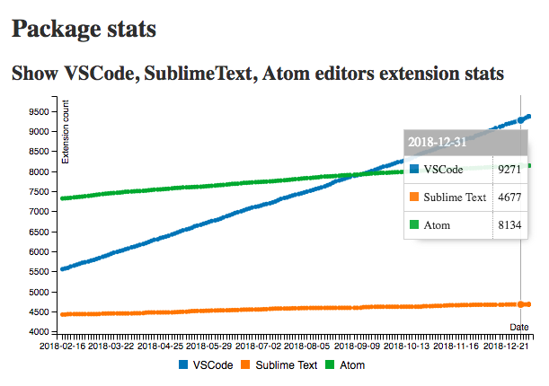

# Extension stats

Extension stats of 3 popular editor: VSCode, Sublime and Atom.

## Development

1. [Create GitHub Personel Access Token with Gist permission](https://github.com/settings/tokens/new)
2. Create a gist with filename `dashbord.yml`
3. Copy `.env.example` to `.env`
4. Paste gist id and access token in `.env`
5. Visit `http://bottoml.in/e/YOUR_GITHUB_USERNAME/GIST_ID`
6. Check DevTools' `Disable Cache` for development use

Built with [@kantord/just-dashboard](https://github.com/kantord/just-dashboard)

## License

MIT
